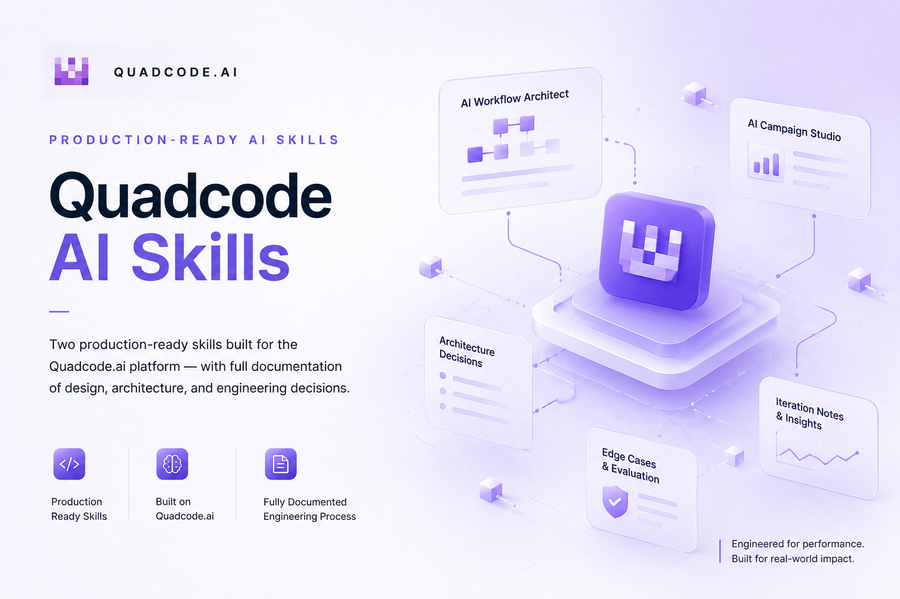

# Quadcode AI Skills 

> Platform: Quadcode.ai

---

## Overview

This repository contains two production-ready skills built for the Quadcode.ai platform, along with full documentation of the engineering process — architecture decisions, iteration notes, edge case analysis, and evaluation criteria.

Both skills were designed, built, tested, and refined directly on the Quadcode.ai platform using its native skill system (SKILL.md format), agent infrastructure, and multimodal generation capabilities.

---

## Skills Built

| Skill | Alias | Type | Purpose |
|-------|-------|------|---------|
| AI Workflow Architect | `analyst_create_workflow` | tools: analyst | Transforms a project idea into a complete technical blueprint |
| AI Campaign Studio | `design_create_campaign` | tools: designer | Transforms a brand brief into a full visual campaign and asset system |

---

## Skill 1 — AI Workflow Architect

**Problem it solves:**  
Developers and product managers spend hours architecting new projects from scratch — choosing tech stack, designing DB schema, planning API structure, writing roadmaps. This skill compresses that process from hours to minutes.

**How it works:**  
6-stage pipeline with adaptive clarification. The skill extracts intent, evaluates confidence, asks only critical questions, generates full architecture, plans execution, and runs an LLM Critic validation.

**Key design decisions:**
- Confidence scoring (0–100%) determines whether clarification is needed
- CRITICAL RULE: agent stops and waits if any clarification question is asked — no premature generation
- Step 4.5 (Architecture Confidence Review) catches gaps before the LLM Critic runs
- LLM Critic must identify risks from different categories (Technical / Business / Compliance)

**Tested on:**
- AI-powered tutoring app for math learners
- Freelance marketplace for designers

---

## Skill 2 — AI Campaign Studio

**Problem it solves:**  
Brand and marketing teams spend days developing campaign concepts, visual directions, and producing assets. This skill generates a complete visual campaign — concept, brand system, style anchor, and production-ready assets — from a single brief.

**How it works:**  
8-stage pipeline including differentiation analysis, brand system definition, style anchor creation, asset planning, image generation via Nanobanana, and style consistency audit.

**Key design decisions:**
- Style Anchor: a fixed parameter block copied verbatim into every image prompt — prevents style drift between assets
- Differentiation Strategy (Step 1.5): analyzes category clichés before generating anything
- 70/30 rule: at least 70% of assets must show concrete business context, max 30% abstract metaphor
- Style Consistency Report with PASS/FAIL scores per category

**Tested on:**
- Minimalist coffee brand for young professionals

---

## Project Structure

```
quadcode-ai-skills/
│
├── README.md
├── platform_research.md
├── design_decisions.md
│
├── skill_1_ai_workflow_architect/
│   ├── SKILL.md
│   ├── description.md
│   ├── architecture.md
│   ├── edge_cases.md
│   ├── examples/
│   │   ├── example_1_tutoring_app.md
│   │   └── example_2_designer_marketplace.md
│   └── evals/
│       ├── evaluation_criteria.md
│       └── iteration_notes.md
│
├── skill_2_ai_campaign_studio/
│   ├── SKILL.md
│   ├── description.md
│   ├── architecture.md
│   ├── edge_cases.md
│   ├── examples/
│   │   └── example_1_coffee_brand.md
│   └── evals/
│       ├── evaluation_criteria.md
│       └── iteration_notes.md

```

---

## AI Engineering Principles Applied

**Reliability** — both skills use validation checklists and confidence scoring to prevent incomplete or premature outputs.

**Iteration** — skills were tested on multiple inputs, failure cases documented, and prompts refined based on observed behavior.

**Evaluation** — quantitative evaluation criteria defined for both skills with measurable metrics.

**Modularity** — each workflow stage has clear inputs, outputs, and rules. Stages can be reasoned about and improved independently.

**Product thinking** — skills solve real user problems for the platform's target audience: developers, designers, product managers, and AI enthusiasts.
